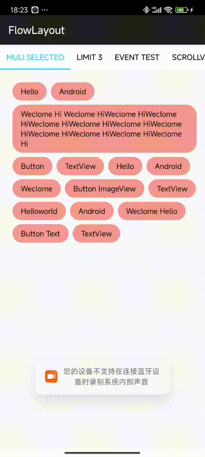
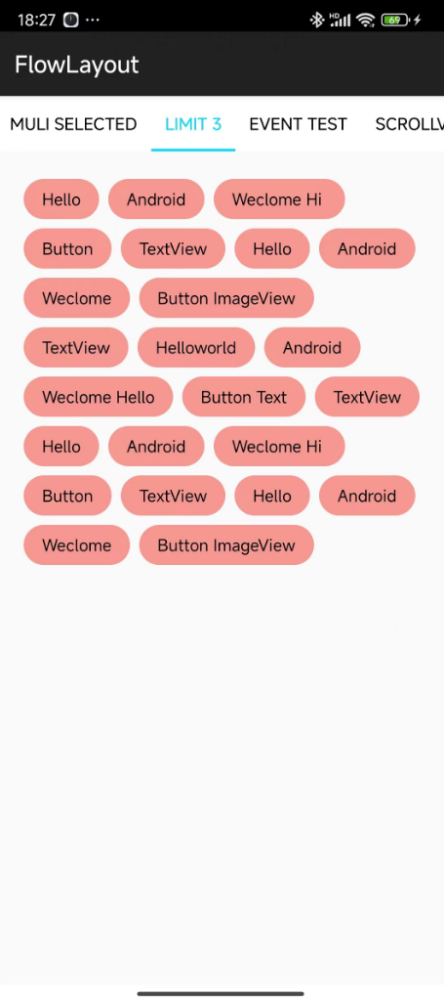

#### FlowLayout
Android流式布局，支持单选、多选等，适合用于产品标签等。

**特色**

* 以setAdapter形式注入数据
* 直接设置`selector`为`background`即可完成标签选则的切换，类似`CheckBox`
* 支持控制选择的Tag数量，比如：单选、多选
* 支持`setOnTagClickListener`，当点击某个Tag回调
* 支持`setOnSelectListener`，当选择某个Tag后回调
* 支持 `adapter.notifyDataChanged`
* Activity重建（或者旋转）后，选择的状态自动保存
* 支持`addTagList(List<T> tagList)` 添加更多的标签数据
* 支持清空选中的标签`clearSelectView()` 
* 达到最大选择标签数量时支持回调`onMaxSelected()`

#### 效果图





#### 用法

```java
dependencies {
    implementation 'com.github.githubwwj:FlowLayout:v1.2'
}
```

#### 声明
布局文件中声明：

```java
<wen.view.flowlayout.TagFlowLayout
        android:id="@+id/id_flowlayout"
        android:layout_width="match_parent"
        android:layout_height="wrap_content"
        android:padding="20dp"
        wen:max_select="-1" />
```

支持属性：

- `max_select`：`-1`为不限制选择数量，`>=1`的数字为控制选择`tag`的数量
- 支持通过`state=checked`来控制选中和取消，也可以自己在`Adapter`的`onSelected(int position, View view)`和`unSelected(int position, View view)`中分别处理显示。

#### 设置数据

```java
mFlowLayout.setAdapter(new TagAdapter<String>(mVals) {
    @Override
    public View getView(FlowLayout parent, int position, String s) {
        TextView tv = (TextView) mInflater.inflate(R.layout.tv, mFlowLayout, false);
        tv.setText(s);
        return tv;
    }
});
```

#### 选中状态

```java
<?xml version="1.0" encoding="utf-8"?>
<selector xmlns:android="http://schemas.android.com/apk/res/android">
    <item android:drawable="@drawable/checked_bg" android:state_checked="true" />
    <item android:drawable="@drawable/normal_bg" />
</selector>
```

设置个标签的背景，一个状态为选中状态，另一个为正常状态。另一种写法，写在Java代码中：

```java
public void onSelected(int position, View view) {
    Log.d("FlowLayout", "onSelected " + position);
}

public void unSelected(int position, View view) {
    Log.d("FlowLayout", "unSelected " + position);
}
```

#### 点击标签事件回调
```java
 mFlowLayout.setOnTagClickListener((view1, position, parent) -> {
        Toast.makeText(getActivity(), mVals[position], Toast.LENGTH_SHORT).show();
});
```

#### 选中多个标签回调
```java
mFlowLayout.setOnSelectListener(new TagFlowLayout.OnSelectListener() {
    @Override
    public void onSelected(Set<Integer> selectPosSet) {
        getActivity().setTitle("choose:" + selectPosSet.toString());
    }
});
```
#### 预先选中某些标签
```java
//预先设置选中
mFlowLayout.setSelectedList(1, 3, 5, 7, 8, 9);

//获得所有选中的标签位置副本
mFlowLayout.getSelectedList();
```
